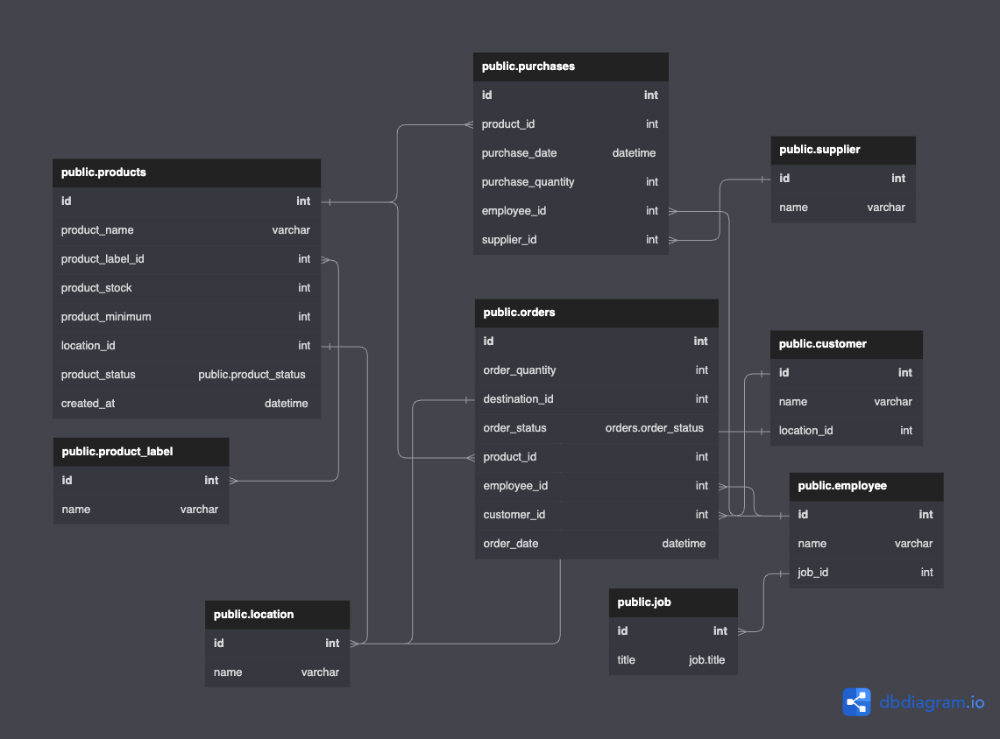

# RFC

# Summary

Create a warehouse management system to track two main function of warehousing; receiving (incoming) and shipping (outgoing) of a product. Product stock is incremented by purchases and is decreases by orders. 

# Problem and Motivation

The system that we are using right now is outdated and started getting painful to manage. One of the current problem to solve is to alert the nearby warehouses when there is a costumer who want to make a purchase and alert warehouses itself when product stored is going to depleted

# Detailed Design

## ERD

## API Contract

| endpoint | method | response | payload | description |
| --- | --- | --- | --- | --- |
| /orders/{customer_id} | POST | { "status": 200, "message": { "en": "Success", "id": "Berhasil" }, "data": { "order_id": "7HW34R93" } | { "id": 17, "order_quantity": 7, "order_destination": 12,"product_id": 1234512934, "customer_id": 9912783 } | place an order |
| /track/?id={order_id} | GET | { "status": 200, "message": { "en": "Success", "id": "Berhasil" }, "data": { "order_status": "delayed" } | - | track the order |
| /products | POST | { "status": 200, "message": { "en": "Success", "id": "Berhasil" }, | { "id": 1234512934, "product_name": "Fish Vitamin", "product_label_id": 12, "product_stock": 99, "product_received": 1, "location_id": 13 } | create new product |
| /products | PUT | { "status": 200, "message": { "en": "Success", "id": "Berhasil"} | { "id": 087659145325, "product_name": "Fish Food", "product_label_id": 12, "product_stock": 99,"product_received": 1, "location_id": 13 } | edit product |
| /products | DELETE | { "status": 200, "message": { "en": "Success", "id": "Berhasil" } | - | delete product |
| /purchase | POST | { "status": 200, "message": { "en": "Success", "id": "Berhasil" } | { "product_id": 120364, "purchase_quantity": 564, "employee_id": 2394074, "supplier_id": 123 } | create new purchase |